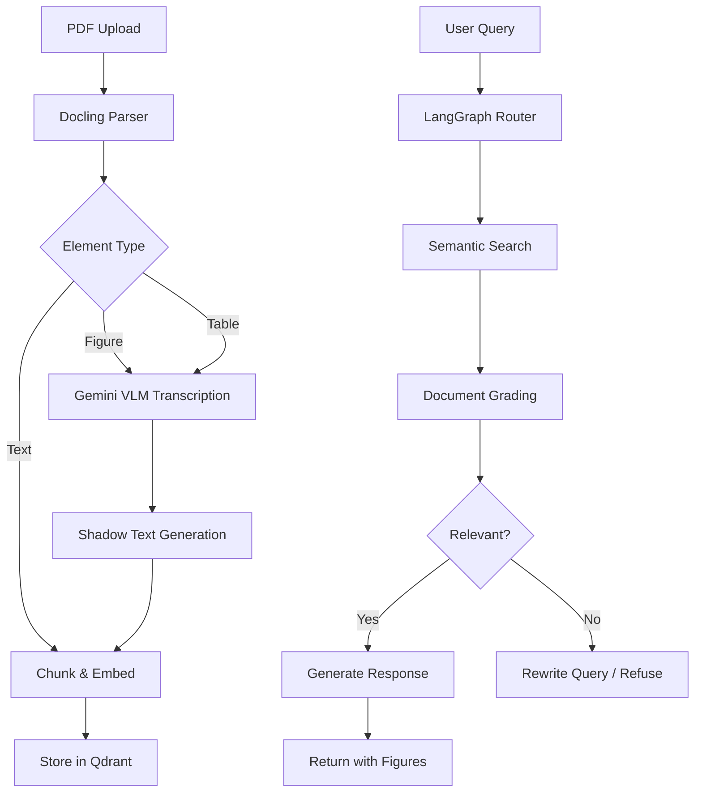
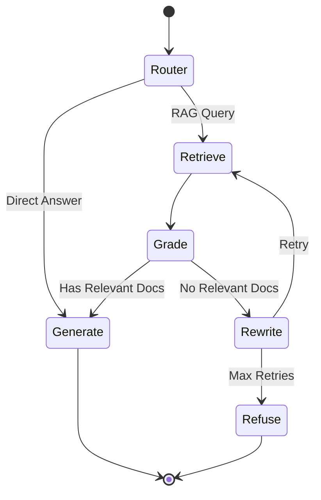

<p align="center">
  
  
  
  
  
</p>

<h1 align="center">🔍 Multimodal Agentic RAG Pipeline</h1>

<p align="center">
  <strong>A production-grade Retrieval-Augmented Generation system with multimodal support for PDFs, images, tables, and figures.</strong>
</p>

<p align="center">
  Built with Docling • Gemini VLM • Groq LLMs • Qdrant Vector DB • LangGraph
</p>

---

## 📋 Table of Contents

- [Overview](#-overview)
- [Key Features](#-key-features)
- [Architecture](#-architecture)
- [Tech Stack](#-tech-stack)
- [Installation](#-installation)
- [Usage](#-usage)
- [API Reference](#-api-reference)
- [Project Structure](#-project-structure)
- [Configuration](#-configuration)
- [License](#-license)

---

## 🎯 Overview

This project implements a **state-of-the-art Agentic RAG (Retrieval-Augmented Generation) pipeline** that can ingest PDF documents, extract text, tables, and figures, and provide intelligent question-answering with multimodal support.

Unlike traditional RAG systems that only handle text, this pipeline:
- 📊 **Extracts and transcribes tables** with structure preservation
- 🖼️ **Processes figures and diagrams** using Vision Language Models
- 🧠 **Uses agentic reasoning** with LangGraph for adaptive retrieval
- 🎯 **Provides accurate, grounded answers** with anti-hallucination safeguards

---

## ✨ Key Features

### 🔄 Intelligent Document Processing
- **PDF Parsing**: Uses IBM's Docling for high-fidelity document understanding
- **Figure Extraction**: Identifies and extracts individual figures from pages
- **Table Detection**: Preserves table structure in Markdown format
- **OCR Support**: Automatic text extraction from scanned documents

### 🤖 Multimodal Understanding
- **Gemini VLM Integration**: Transcribes figures, diagrams, and charts to searchable text
- **Rich Metadata**: Captures figure numbers, captions, and surrounding context
- **Shadow Text**: Creates semantic representations for visual content

### 🧩 Agentic RAG with LangGraph
- **Adaptive Retrieval**: Intelligent query routing and rewriting
- **Document Grading**: LLM-based relevance scoring
- **Visual Query Detection**: Automatically includes figures when needed
- **Anti-Hallucination**: Refuses to answer out-of-scope questions

### 💾 Vector Storage
- **Qdrant Integration**: High-performance vector similarity search
- **Sentence Transformers**: all-MiniLM-L6-v2 embeddings (384 dimensions)
- **Hybrid Search**: Combines semantic search with metadata filtering

### 🎨 Modern Web Interface
- **React + Vite**: Fast, responsive chat interface
- **Real-time Ingestion**: Progress tracking during document processing
- **Inline Images**: Figures displayed directly in chat responses

---

## 🏗️ Architecture

```
┌─────────────────────────────────────────────────────────────────────────────┐
│                           FRONTEND (React + Vite)                           │
│  ┌─────────────┐  ┌─────────────┐  ┌─────────────┐  ┌─────────────────────┐ │
│  │   Upload    │  │    Chat     │  │   Reset     │  │  Image Display      │ │
│  │   Component │  │  Interface  │  │   System    │  │  (Inline Figures)   │ │
│  └──────┬──────┘  └──────┬──────┘  └──────┬──────┘  └─────────────────────┘ │
└─────────┼────────────────┼────────────────┼─────────────────────────────────┘
          │                │                │
          ▼                ▼                ▼
┌─────────────────────────────────────────────────────────────────────────────┐
│                           BACKEND (FastAPI)                                 │
│  ┌──────────────────────────────────────────────────────────────────────┐   │
│  │                         API Layer (api.py)                            │   │
│  │   POST /ingest  │  POST /chat  │  POST /reset  │  GET /images/{file} │   │
│  └────────┬─────────────────┬─────────────────┬─────────────────────────┘   │
│           │                 │                 │                             │
│           ▼                 ▼                 ▼                             │
│  ┌────────────────┐  ┌─────────────────┐  ┌──────────────────────────────┐  │
│  │  IngestScript  │  │   GraphBrain    │  │      Vector Store            │  │
│  │  ┌──────────┐  │  │   (LangGraph)   │  │      (Qdrant)                │  │
│  │  │PDF Parser│  │  │  ┌───────────┐  │  │  ┌────────────────────────┐  │  │
│  │  │(Docling) │  │  │  │  Router   │  │  │  │ Collection:            │  │  │
│  │  └────┬─────┘  │  │  └─────┬─────┘  │  │  │ pdf_documents          │  │  │
│  │       │        │  │        │        │  │  │                        │  │  │
│  │  ┌────▼─────┐  │  │  ┌─────▼─────┐  │  │  │ Fields:                │  │  │
│  │  │ Gemini   │  │  │  │ Retrieve  │  │  │  │ - shadow_text          │  │  │
│  │  │Transcribe│  │  │  └─────┬─────┘  │  │  │ - element_type         │  │  │
│  │  └────┬─────┘  │  │        │        │  │  │ - page_number          │  │  │
│  │       │        │  │  ┌─────▼─────┐  │  │  │ - original_image_path  │  │  │
│  │  ┌────▼─────┐  │  │  │   Grade   │  │  │  │ - source_pdf           │  │  │
│  │  │ Embed &  │  │  │  │(LLM-based)│  │  │  └────────────────────────┘  │  │
│  │  │  Store   │──┼──┼──▶           │  │  │                              │  │
│  │  └──────────┘  │  │  └─────┬─────┘  │  └──────────────────────────────┘  │
│  └────────────────┘  │        │        │                                    │
│                      │  ┌─────▼─────┐  │                                    │
│                      │  │ Generate  │  │                                    │
│                      │  │  (Groq)   │  │                                    │
│                      │  └───────────┘  │                                    │
│                      └─────────────────┘                                    │
└─────────────────────────────────────────────────────────────────────────────┘
                                    │
          ┌─────────────────────────┼─────────────────────────┐
          ▼                         ▼                         ▼
   ┌─────────────┐          ┌─────────────┐          ┌─────────────┐
   │   Groq API  │          │ Gemini API  │          │   Qdrant    │
   │  (LLM/Chat) │          │    (VLM)    │          │  (Vectors)  │
   │  llama-3.3  │          │ gemini-2.0  │          │  localhost  │
   │  70b-versa  │          │   flash     │          │   :6333     │
   └─────────────┘          └─────────────┘          └─────────────┘
```

### 📊 Data Flow



### 🧠 RAG Graph State Machine



---

## 🛠️ Tech Stack

| Component | Technology | Purpose |
|-----------|------------|---------|
| **Backend** | FastAPI | Async REST API server |
| **Frontend** | React + Vite | Modern web interface |
| **PDF Processing** | Docling (IBM) | Document structure extraction |
| **Vision LLM** | Gemini 2.0 Flash | Figure/table transcription |
| **Chat LLM** | Groq (Llama 3.3 70B) | Response generation |
| **Embeddings** | Sentence Transformers | Text vectorization |
| **Vector DB** | Qdrant | Similarity search |
| **Orchestration** | LangGraph | Agentic workflow |
| **Styling** | TailwindCSS | UI components |

---

## 📦 Installation

### Prerequisites

- Python 3.11+
- Node.js 18+
- Docker (for Qdrant)

### 1. Clone the Repository

```bash
git clone https://github.com/yourusername/multimodal-rag-pipeline.git
cd multimodal-rag-pipeline
```

### 2. Set Up Python Environment

```bash
python -m venv .venv
.\.venv\Scripts\activate  # Windows
# source .venv/bin/activate  # Linux/Mac

pip install -r requirements.txt
```

### 3. Configure Environment Variables

```bash
cp .env.example .env
```

Edit `.env` with your API keys:

```env
GROQ_API_KEY=your_groq_api_key
GOOGLE_API_KEY=your_google_gemini_api_key
QDRANT_HOST=localhost
QDRANT_PORT=6333
```

### 4. Start Qdrant (Docker)

```bash
docker run -p 6333:6333 -p 6334:6334 qdrant/qdrant
```

### 5. Install Frontend Dependencies

```bash
cd frontend
npm install
```

---

## 🚀 Usage

### Start the Backend

```bash
.\.venv\Scripts\python -m uvicorn backend.main:app --port 8000 --host 0.0.0.0
```

### Start the Frontend

```bash
cd frontend
npm run dev
```

### Access the Application

Open http://localhost:5173 in your browser.

### Workflow

1. **Upload a PDF** - Drag and drop or click to upload
2. **Wait for Ingestion** - Watch the progress indicator (~2-3 min for multimodal)
3. **Ask Questions** - Chat naturally about the document
4. **View Figures** - Relevant images appear inline in responses

---

## 📡 API Reference

### `POST /ingest`

Upload and process a PDF document.

**Request:**
```bash
curl -X POST http://localhost:8000/ingest \
  -F "file=@document.pdf" \
  -F "filename=document.pdf"
```

**Response:**
```json
{
  "status": "complete",
  "filename": "document.pdf",
  "stats": {
    "total_elements": 15,
    "text_chunks": 12,
    "tables": 0,
    "figures": 3,
    "stored": 16
  }
}
```

### `POST /chat`

Send a query and get a response.

**Request:**
```json
{
  "message": "What are Meissner corpuscles?"
}
```

**Response:**
```json
{
  "response": "### Meissner Corpuscles\n\n* Located in **glabrous (hairless) skin**\n* Found in high density in the **digits** and around the **mouth**\n* Responsible for sensitivity to **light touch**...",
  "relevant_documents": [
    {
      "id": "abc123",
      "element_type": "figure",
      "page_number": 1,
      "original_image_path": "E:/output/figure_1_page_1.png"
    }
  ]
}
```

### `POST /reset`

Clear the vector database for a new document.

### `GET /images/{filename}`

Serve extracted figure images.

---

## 📁 Project Structure

```
multimodal-rag-pipeline/
├── backend/
│   ├── main.py                    # FastAPI app entry point
│   ├── api.py                     # API routes
│   ├── IngestScript/
│   │   ├── ingest.py              # Main ingestion orchestrator
│   │   └── services/
│   │       ├── pdf_parser.py      # Docling PDF extraction
│   │       ├── gemini_transcriber.py  # VLM transcription
│   │       └── vector_store.py    # Qdrant operations
│   └── GraphBrain/
│       └── graph.py               # LangGraph RAG pipeline
├── frontend/
│   ├── src/
│   │   ├── App.jsx                # Main React component
│   │   └── index.css              # TailwindCSS styles
│   ├── package.json
│   └── vite.config.js
├── output/                        # Extracted images
├── requirements.txt
├── .env.example
└── README.md
```

---

## ⚙️ Configuration

### Ingestion Settings

| Setting | Default | Description |
|---------|---------|-------------|
| `GEMINI_DELAY_SECONDS` | 35 | Delay between Gemini API calls (rate limiting) |
| `CHUNK_SIZE` | 1000 | Text chunk size for embedding |
| `CHUNK_OVERLAP` | 200 | Overlap between chunks |

### RAG Settings

| Setting | Default | Description |
|---------|---------|-------------|
| `TOP_K` | 10 | Number of documents to retrieve |
| `MAX_RETRIES` | 2 | Query rewrite attempts |
| `TEMPERATURE` | 0.3 | LLM response randomness |

---

## 🔒 Anti-Hallucination Features

1. **Out-of-Scope Detection**: When no relevant documents are found, the system refuses to answer
2. **Grounded Generation**: LLM is instructed to ONLY use document context
3. **Document Grading**: LLM-based relevance scoring filters irrelevant content
4. **Low Temperature**: 0.3 temperature for factual responses

---

## 📄 License

This project is licensed under the MIT License - see the [LICENSE](LICENSE) file for details.

---

<p align="center">
  Made with ❤️ for the future of document intelligence
</p>
